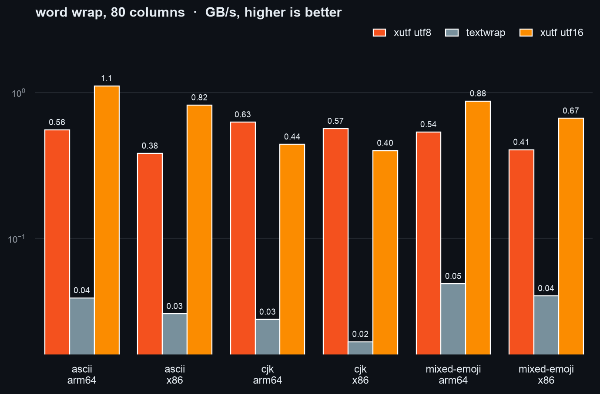
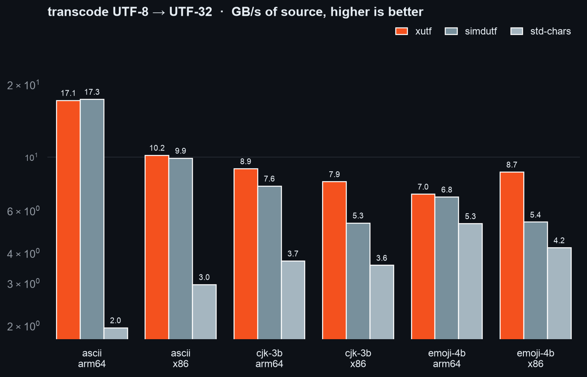
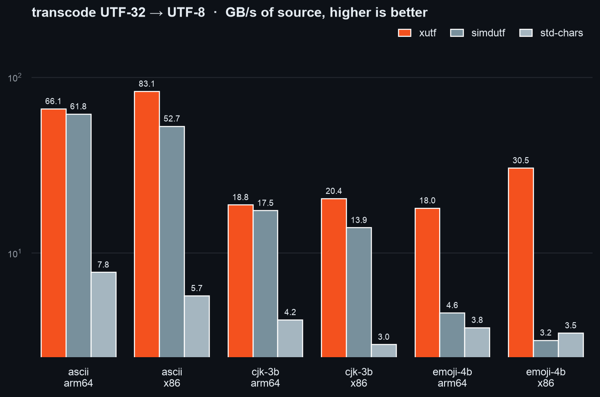
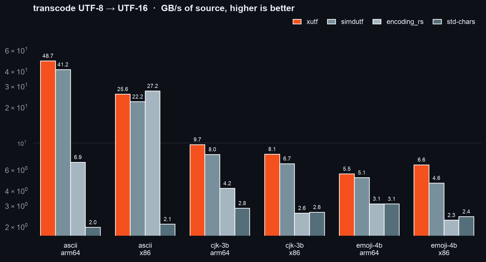
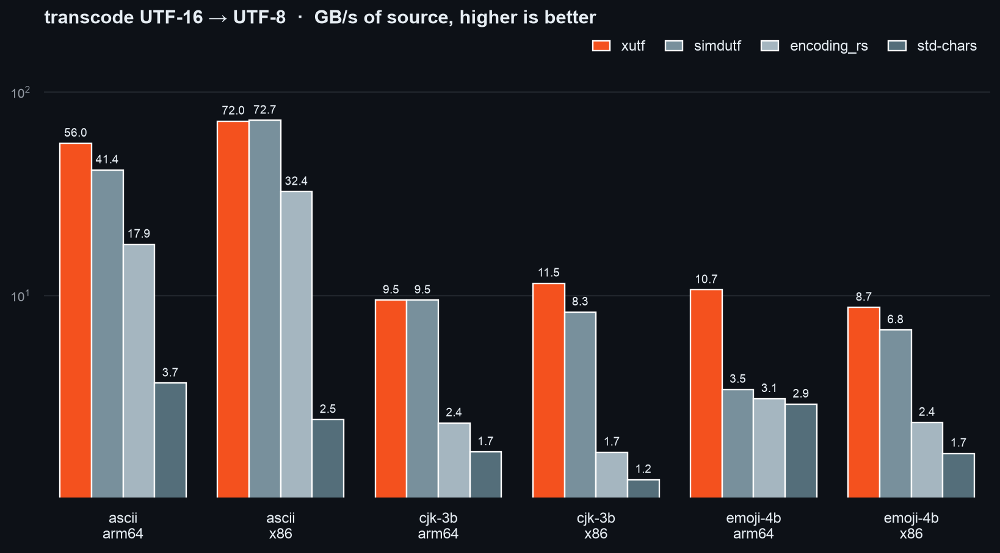
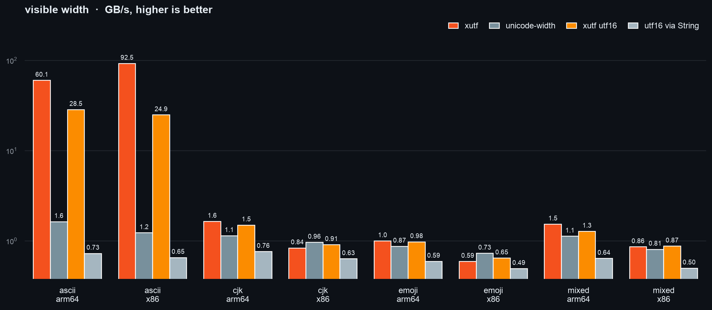
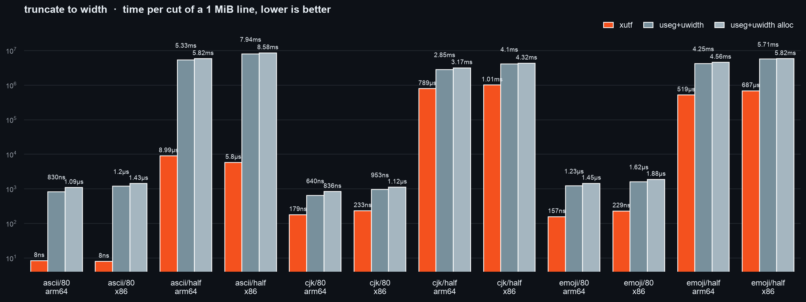
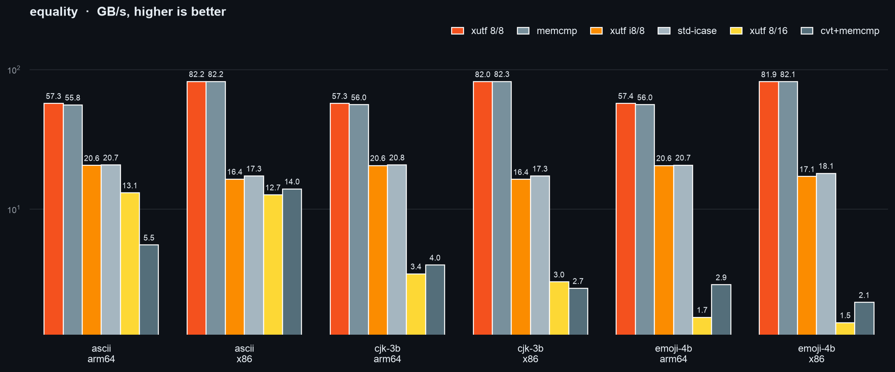
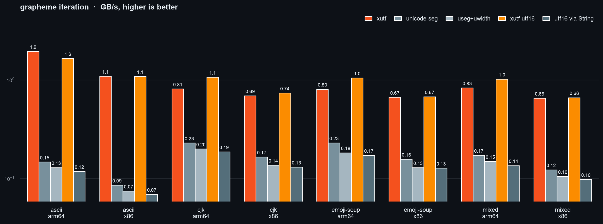

# xutf

[](https://github.com/can1357/xutf/actions/workflows/ci.yml)
[](#license)

Fast, permissive UTF-8 / UTF-16 / UTF-32 transcoding, comparison and BOM
detection — plus allocation-free terminal text primitives (graphemes, visible
width, truncation, word wrap, in-place ANSI stripping).

Decoding never fails: truncated sequences, lone surrogates, garbage in →
defined output out. Safe to point at untrusted bytes.

## Why it's fast

The core is a Rust port of the branchless UTF kernel from
[`xstd`](https://github.com/can1357/xstd/blob/master/includes/xstd/utf.hpp).
The trick: UTF-8 is just a bit permutation, so one mask table drives both
directions — `pext` gathers payload bits on decode, `pdep` scatters them on
encode. No shuffle tables, no per-codepoint branches. Bulk paths use
`core::simd` plus hand-written AVX-512 and NEON kernels.

The result: beats `simdutf` across nearly the entire grid, ASCII included,
roughly 1.5–2× ahead on typical text, and **3–10×** ahead on emoji-heavy input.

## Features

- **Every encoding pair** — UTF-8/16/32, with foreign endianness as a type
  parameter (`Utf16Be`, `Utf32Le`, …); the byte swap is folded into the kernels.
- **Cross-encoding comparison** — equality, ordering, and ASCII case-folding
  between different encodings, no conversion needed.
- **Terminal text on UTF-8, UTF-16, or UTF-32** — UAX #29 grapheme clusters,
  UAX #11 width, cluster-safe truncate and word wrap, plus SIMD ANSI/VT
  stripping that reuses owned buffers and compacts mutable slices in place.
- **Scalar property lookups** — NFC/NFD/NFKC/NFKD normalization with a SIMD
  quick-check, plus `General_Category` (fine categories and the
  `\p{L}`-style groups) and UAX #24 `Script`, one table load per scalar.
  Free functions or `Ucd` methods on `char`/`u32`; covers the lookup
  surface of `unicode-normalization`, `unicode-properties` and
  `unicode-script`.
- **Strict stream decoding** — `BufReadCharsExt` iterates `char`s straight
  from any `BufRead` in UTF-8/16/32 (either byte order), decoding in batches
  from the reader's own buffer; errors carry the offending bytes. Drop-in for
  the `utf8-chars` crate, 2.5-6x its throughput (`cargo bench --bench chars`).
- **BOM detection** — decode whatever the BOM says, defaulting to UTF-8.
- **`#![no_std]`**, zero runtime dependencies, Unicode 17.0 tables generated
  from the UCD.
- **Differentially tested** — fuzzed against `unicode-segmentation`,
  exhaustive per-scalar parity with `unicode-width`, `unicode-properties`
  and `unicode-script`.

## Benchmarks

~1 MiB inputs, best of 7 samples, GB/s of source bytes, both hosts in each
figure. `simdutf`'s validation-skipping `convert_valid_*` entry points are
excluded — different question. Fastest per row is **bold** in the raw
tables; regenerate with `scripts/bench_hosts.sh` + `scripts/bench_viz.py`.

<!-- benches:begin -->



















<details><summary>Raw numbers per host</summary>

### Apple M4 Max

**Grapheme clusters** (GB/s)

| input      | xutf                 | unicode-seg           | useg+uwidth           | xutf utf16              | utf16 via String      |
| ---------- | -------------------- | --------------------- | --------------------- | ----------------------- | --------------------- |
| ascii      | **1.9 GB/s (1.00x)** | 0.1 GB/s (▼ +1221.9%) | 0.1 GB/s (▼ +1403.0%) | 1.6 GB/s (▼ +18.1%)     | 0.1 GB/s (▼ +1546.0%) |
| cjk        | 0.8 GB/s (1.00x)     | 0.2 GB/s (▼ +253.0%)  | 0.2 GB/s (▼ +305.9%)  | **1.1 GB/s (▲ -31.1%)** | 0.2 GB/s (▼ +333.9%)  |
| emoji-soup | 0.8 GB/s (1.00x)     | 0.2 GB/s (▼ +249.7%)  | 0.2 GB/s (▼ +340.4%)  | **1.0 GB/s (▲ -30.1%)** | 0.2 GB/s (▼ +368.9%)  |
| mixed      | 0.8 GB/s (1.00x)     | 0.2 GB/s (▼ +382.8%)  | 0.1 GB/s (▼ +456.7%)  | **1.0 GB/s (▲ -22.7%)** | 0.1 GB/s (▼ +513.9%)  |

**UTF-8 -> UTF-16** (GB/s)

| input    | xutf                  | simdutf              | encoding_rs          | std-chars             |
| -------- | --------------------- | -------------------- | -------------------- | --------------------- |
| ascii    | **48.7 GB/s (1.00x)** | 41.2 GB/s (▼ +18.2%) | 6.9 GB/s (▼ +605.9%) | 2.0 GB/s (▼ +2378.0%) |
| cjk-3b   | **9.7 GB/s (1.00x)**  | 8.0 GB/s (▼ +20.9%)  | 4.2 GB/s (▼ +132.7%) | 2.8 GB/s (▼ +241.2%)  |
| emoji-4b | **5.5 GB/s (1.00x)**  | 5.1 GB/s (▼ +7.3%)   | 3.1 GB/s (▼ +77.9%)  | 3.1 GB/s (▼ +78.3%)   |

**UTF-16 -> UTF-8** (GB/s)

| input    | xutf                  | simdutf              | encoding_rs           | std-chars             |
| -------- | --------------------- | -------------------- | --------------------- | --------------------- |
| ascii    | **56.0 GB/s (1.00x)** | 41.4 GB/s (▼ +35.3%) | 17.9 GB/s (▼ +213.8%) | 3.7 GB/s (▼ +1411.2%) |
| cjk-3b   | **9.5 GB/s (1.00x)**  | **9.5 GB/s (1.00x)** | 2.4 GB/s (▼ +301.7%)  | 1.7 GB/s (▼ +457.2%)  |
| emoji-4b | **10.7 GB/s (1.00x)** | 3.5 GB/s (▼ +208.8%) | 3.1 GB/s (▼ +243.1%)  | 2.9 GB/s (▼ +265.0%)  |

**UTF-8 -> UTF-32** (GB/s)

| input    | xutf                 | simdutf                 | std-chars            |
| -------- | -------------------- | ----------------------- | -------------------- |
| ascii    | 17.1 GB/s (1.00x)    | **17.3 GB/s (▲ -1.1%)** | 2.0 GB/s (▼ +776.4%) |
| cjk-3b   | **8.9 GB/s (1.00x)** | 7.6 GB/s (▼ +18.0%)     | 3.7 GB/s (▼ +141.2%) |
| emoji-4b | **7.0 GB/s (1.00x)** | 6.8 GB/s (▼ +2.8%)      | 5.3 GB/s (▼ +32.6%)  |

**UTF-32 -> UTF-8** (GB/s)

| input    | xutf                  | simdutf              | std-chars            |
| -------- | --------------------- | -------------------- | -------------------- |
| ascii    | **66.1 GB/s (1.00x)** | 61.8 GB/s (▼ +7.0%)  | 7.8 GB/s (▼ +750.1%) |
| cjk-3b   | **18.8 GB/s (1.00x)** | 17.5 GB/s (▼ +7.8%)  | 4.2 GB/s (▼ +350.7%) |
| emoji-4b | **18.0 GB/s (1.00x)** | 4.6 GB/s (▼ +294.0%) | 3.8 GB/s (▼ +378.1%) |

**equality** (GB/s)

| input    | xutf 8/8              | memcmp              | xutf i8/8             | std-icase             | xutf 8/16             | cvt+memcmp            |
| -------- | --------------------- | ------------------- | --------------------- | --------------------- | --------------------- | --------------------- |
| ascii    | **57.3 GB/s (1.00x)** | 55.8 GB/s (▼ +2.6%) | 20.6 GB/s (▼ +178.4%) | 20.7 GB/s (▼ +176.1%) | 13.1 GB/s (▼ +337.0%) | 5.5 GB/s (▼ +934.1%)  |
| cjk-3b   | **57.3 GB/s (1.00x)** | 56.0 GB/s (▼ +2.2%) | 20.6 GB/s (▼ +178.3%) | 20.8 GB/s (▼ +175.6%) | 3.4 GB/s (▼ +1563.6%) | 4.0 GB/s (▼ +1338.4%) |
| emoji-4b | **57.4 GB/s (1.00x)** | 56.0 GB/s (▼ +2.4%) | 20.6 GB/s (▼ +179.2%) | 20.7 GB/s (▼ +177.0%) | 1.7 GB/s (▼ +3311.9%) | 2.9 GB/s (▼ +1895.2%) |

**Width truncation** (GB/s)

| input      | xutf                      | useg+uwidth              | useg+uwidth alloc        |
| ---------- | ------------------------- | ------------------------ | ------------------------ |
| ascii/80   | **124901.7 GB/s (1.00x)** | 1263.0 GB/s (▼ +9789.3%) | 959.9 GB/s (▼ +12912.5%) |
| ascii/half | **116.7 GB/s (1.00x)**    | 0.2 GB/s (▼ +59202.3%)   | 0.2 GB/s (▼ +64668.3%)   |
| cjk/80     | **5849.5 GB/s (1.00x)**   | 1637.1 GB/s (▼ +257.3%)  | 1253.8 GB/s (▼ +366.5%)  |
| cjk/half   | **1.3 GB/s (1.00x)**      | 0.4 GB/s (▼ +261.4%)     | 0.3 GB/s (▼ +302.2%)     |
| emoji/80   | **6670.1 GB/s (1.00x)**   | 854.5 GB/s (▼ +680.6%)   | 725.4 GB/s (▼ +819.5%)   |
| emoji/half | **2.0 GB/s (1.00x)**      | 0.2 GB/s (▼ +718.4%)     | 0.2 GB/s (▼ +779.8%)     |

**Visible width** (GB/s)

| input | xutf                  | unicode-width         | xutf utf16            | utf16 via String      |
| ----- | --------------------- | --------------------- | --------------------- | --------------------- |
| ascii | **60.1 GB/s (1.00x)** | 1.6 GB/s (▼ +3572.6%) | 28.5 GB/s (▼ +110.7%) | 0.7 GB/s (▼ +8155.4%) |
| cjk   | **1.6 GB/s (1.00x)**  | 1.1 GB/s (▼ +44.1%)   | 1.5 GB/s (▼ +9.7%)    | 0.8 GB/s (▼ +115.9%)  |
| emoji | **1.0 GB/s (1.00x)**  | 0.9 GB/s (▼ +14.7%)   | 1.0 GB/s (▼ +2.4%)    | 0.6 GB/s (▼ +68.4%)   |
| mixed | **1.5 GB/s (1.00x)**  | 1.1 GB/s (▼ +36.3%)   | 1.3 GB/s (▼ +20.2%)   | 0.6 GB/s (▼ +140.0%)  |

**word wrap at 80 columns** (GB/s)

| input       | xutf utf8            | textwrap              | xutf utf16               |
| ----------- | -------------------- | --------------------- | ------------------------ |
| ascii       | 0.6 GB/s (1.00x)     | 0.0 GB/s (▼ +1319.5%) | **1.1 GB/s (▲ -100.1%)** |
| cjk         | **0.6 GB/s (1.00x)** | 0.0 GB/s (▼ +2150.7%) | 0.4 GB/s (▼ +42.0%)      |
| mixed-emoji | 0.5 GB/s (1.00x)     | 0.0 GB/s (▼ +997.0%)  | **0.9 GB/s (▲ -62.9%)**  |

### Xeon x86-64

**Grapheme clusters** (GB/s)

| input      | xutf                 | unicode-seg           | useg+uwidth           | xutf utf16             | utf16 via String      |
| ---------- | -------------------- | --------------------- | --------------------- | ---------------------- | --------------------- |
| ascii      | **1.1 GB/s (1.00x)** | 0.1 GB/s (▼ +1166.3%) | 0.1 GB/s (▼ +1354.1%) | **1.1 GB/s (1.00x)**   | 0.1 GB/s (▼ +1470.3%) |
| cjk        | 0.7 GB/s (1.00x)     | 0.2 GB/s (▼ +317.8%)  | 0.1 GB/s (▼ +406.1%)  | **0.7 GB/s (▲ -6.6%)** | 0.1 GB/s (▼ +428.5%)  |
| emoji-soup | 0.7 GB/s (1.00x)     | 0.2 GB/s (▼ +324.7%)  | 0.1 GB/s (▼ +417.4%)  | **0.7 GB/s (▲ -1.3%)** | 0.1 GB/s (▼ +423.6%)  |
| mixed      | 0.7 GB/s (1.00x)     | 0.1 GB/s (▼ +431.2%)  | 0.1 GB/s (▼ +521.4%)  | **0.7 GB/s (▲ -1.4%)** | 0.1 GB/s (▼ +566.8%)  |

**UTF-8 -> UTF-16** (GB/s)

| input    | xutf                 | simdutf              | encoding_rs             | std-chars             |
| -------- | -------------------- | -------------------- | ----------------------- | --------------------- |
| ascii    | 25.6 GB/s (1.00x)    | 22.2 GB/s (▼ +15.5%) | **27.2 GB/s (▲ -6.3%)** | 2.1 GB/s (▼ +1125.8%) |
| cjk-3b   | **8.1 GB/s (1.00x)** | 6.7 GB/s (▼ +20.1%)  | 2.6 GB/s (▼ +211.5%)    | 2.6 GB/s (▼ +206.1%)  |
| emoji-4b | **6.6 GB/s (1.00x)** | 4.6 GB/s (▼ +42.2%)  | 2.3 GB/s (▼ +191.1%)    | 2.4 GB/s (▼ +171.6%)  |

**UTF-16 -> UTF-8** (GB/s)

| input    | xutf                  | simdutf               | encoding_rs           | std-chars             |
| -------- | --------------------- | --------------------- | --------------------- | --------------------- |
| ascii    | **72.0 GB/s (1.00x)** | **72.7 GB/s (1.00x)** | 32.4 GB/s (▼ +122.3%) | 2.5 GB/s (▼ +2835.5%) |
| cjk-3b   | **11.5 GB/s (1.00x)** | 8.3 GB/s (▼ +38.7%)   | 1.7 GB/s (▼ +577.4%)  | 1.2 GB/s (▼ +824.2%)  |
| emoji-4b | **8.7 GB/s (1.00x)**  | 6.8 GB/s (▼ +29.1%)   | 2.4 GB/s (▼ +267.6%)  | 1.7 GB/s (▼ +421.5%)  |

**UTF-8 -> UTF-32** (GB/s)

| input    | xutf                  | simdutf             | std-chars            |
| -------- | --------------------- | ------------------- | -------------------- |
| ascii    | **10.2 GB/s (1.00x)** | 9.9 GB/s (▼ +2.8%)  | 3.0 GB/s (▼ +243.6%) |
| cjk-3b   | **7.9 GB/s (1.00x)**  | 5.3 GB/s (▼ +48.3%) | 3.6 GB/s (▼ +122.2%) |
| emoji-4b | **8.7 GB/s (1.00x)**  | 5.4 GB/s (▼ +61.3%) | 4.2 GB/s (▼ +106.1%) |

**UTF-32 -> UTF-8** (GB/s)

| input    | xutf                  | simdutf              | std-chars             |
| -------- | --------------------- | -------------------- | --------------------- |
| ascii    | **83.1 GB/s (1.00x)** | 52.7 GB/s (▼ +57.9%) | 5.7 GB/s (▼ +1354.6%) |
| cjk-3b   | **20.4 GB/s (1.00x)** | 13.9 GB/s (▼ +46.4%) | 3.0 GB/s (▼ +575.2%)  |
| emoji-4b | **30.5 GB/s (1.00x)** | 3.2 GB/s (▼ +853.9%) | 3.5 GB/s (▼ +767.8%)  |

**equality** (GB/s)

| input    | xutf 8/8              | memcmp                | xutf i8/8             | std-icase             | xutf 8/16             | cvt+memcmp            |
| -------- | --------------------- | --------------------- | --------------------- | --------------------- | --------------------- | --------------------- |
| ascii    | **82.2 GB/s (1.00x)** | **82.2 GB/s (1.00x)** | 16.4 GB/s (▼ +400.4%) | 17.3 GB/s (▼ +375.4%) | 12.7 GB/s (▼ +548.9%) | 14.0 GB/s (▼ +488.3%) |
| cjk-3b   | **82.0 GB/s (1.00x)** | **82.3 GB/s (1.00x)** | 16.4 GB/s (▼ +401.4%) | 17.3 GB/s (▼ +374.5%) | 3.0 GB/s (▼ +2622.1%) | 2.7 GB/s (▼ +2929.5%) |
| emoji-4b | **81.9 GB/s (1.00x)** | **82.1 GB/s (1.00x)** | 17.1 GB/s (▼ +377.7%) | 18.1 GB/s (▼ +352.9%) | 1.5 GB/s (▼ +5223.7%) | 2.1 GB/s (▼ +3712.1%) |

**Width truncation** (GB/s)

| input      | xutf                      | useg+uwidth              | useg+uwidth alloc        |
| ---------- | ------------------------- | ------------------------ | ------------------------ |
| ascii/80   | **130401.8 GB/s (1.00x)** | 876.4 GB/s (▼ +14779.1%) | 734.7 GB/s (▼ +17648.7%) |
| ascii/half | **180.7 GB/s (1.00x)**    | 0.1 GB/s (▼ +136719.9%)  | 0.1 GB/s (▼ +147691.6%)  |
| cjk/80     | **4507.6 GB/s (1.00x)**   | 1100.1 GB/s (▼ +309.7%)  | 939.1 GB/s (▼ +380.0%)   |
| cjk/half   | **1.0 GB/s (1.00x)**      | 0.3 GB/s (▼ +306.9%)     | 0.2 GB/s (▼ +329.4%)     |
| emoji/80   | **4576.1 GB/s (1.00x)**   | 647.3 GB/s (▼ +607.0%)   | 558.7 GB/s (▼ +719.0%)   |
| emoji/half | **1.5 GB/s (1.00x)**      | 0.2 GB/s (▼ +731.2%)     | 0.2 GB/s (▼ +746.3%)     |

**Visible width** (GB/s)

| input | xutf                  | unicode-width           | xutf utf16             | utf16 via String       |
| ----- | --------------------- | ----------------------- | ---------------------- | ---------------------- |
| ascii | **92.5 GB/s (1.00x)** | 1.2 GB/s (▼ +7424.3%)   | 24.9 GB/s (▼ +271.8%)  | 0.7 GB/s (▼ +14023.4%) |
| cjk   | 0.8 GB/s (1.00x)      | **1.0 GB/s (▲ -15.4%)** | 0.9 GB/s (▲ -8.8%)     | 0.6 GB/s (▼ +32.0%)    |
| emoji | 0.6 GB/s (1.00x)      | **0.7 GB/s (▲ -23.2%)** | 0.6 GB/s (▲ -9.0%)     | 0.5 GB/s (▼ +20.1%)    |
| mixed | 0.9 GB/s (1.00x)      | 0.8 GB/s (▼ +6.4%)      | **0.9 GB/s (▲ -1.8%)** | 0.5 GB/s (▼ +72.1%)    |

**word wrap at 80 columns** (GB/s)

| input       | xutf utf8            | textwrap              | xutf utf16               |
| ----------- | -------------------- | --------------------- | ------------------------ |
| ascii       | 0.4 GB/s (1.00x)     | 0.0 GB/s (▼ +1157.4%) | **0.8 GB/s (▲ -114.2%)** |
| cjk         | **0.6 GB/s (1.00x)** | 0.0 GB/s (▼ +2788.6%) | 0.4 GB/s (▼ +41.5%)      |
| mixed-emoji | 0.4 GB/s (1.00x)     | 0.0 GB/s (▼ +905.9%)  | **0.7 GB/s (▲ -63.9%)**  |

</details>
<!-- benches:end -->

**ANSI stripping, Apple M4 Max** (GB/s)

| input   | xutf str          | strip-ansi           |
| ------- | ----------------- | -------------------- |
| plain   | 34.6 GB/s (1.00x) | 25.3 GB/s (▼ +36.7%) |
| sgr     | 1.9 GB/s (1.00x)  | 0.5 GB/s (▼ +293.1%) |
| dense   | 1.0 GB/s (1.00x)  | 0.2 GB/s (▼ +321.7%) |
| unicode | 1.8 GB/s (1.00x)  | 0.4 GB/s (▼ +312.9%) |

**NFC/NFD normalization, Apple M4 Max** (GB/s)

| input              | xutf in-place     | unicode-normalization  |
| ------------------ | ----------------- | ---------------------- |
| NFC ascii          | 42.7 GB/s (1.00x) | 0.1 GB/s (▼ +30258.0%) |
| NFC reversed marks | 0.3 GB/s (1.00x)  | 0.2 GB/s (▼ +32.0%)    |
| NFC mixed          | 0.3 GB/s (1.00x)  | 0.2 GB/s (▼ +96.8%)    |
| NFD nfc-latin      | 0.3 GB/s (1.00x)  | 0.2 GB/s (▼ +51.4%)    |
| NFD reversed marks | 0.3 GB/s (1.00x)  | 0.3 GB/s (▼ +3.9%)     |
| NFD mixed          | 0.3 GB/s (1.00x)  | 0.3 GB/s (▼ +27.6%)    |

**Additional terminal APIs, Apple M4 Max**

| API                   | cases                 | latency / throughput | comparison                                       |
| --------------------- | --------------------- | -------------------- | ------------------------------------------------ |
| `truncate_measured`   | 80-column cuts        | ~5.1–221 ns / call   | within 7.1% of `truncate_width`; width included  |
| `skip_columns`        | CJK/emoji half cuts   | 0.9–2.1 GB/s         | 2.3–7.7× `useg+uwidth`                           |
| `skip_columns`        | 80-column early exits | ~8.9–222 ns / call   | 2.7–88.8× `useg+uwidth`                          |
| `width_within(…, 80)` | 80-column input fits  | 10.6 GB/s            | full `visible_width`: 11.0 GB/s                  |
| `grapheme_indices`    | all 4 corpora         | 0.5–0.7 GB/s         | 2.8–3.8× `useg`; within 3.2% of `graphemes`      |
| `wrap_measured`       | CJK/emoji, 40/80 cols | 0.6–0.7 GB/s         | 1.30–1.36× wrap + remeasure; within 2.5% of wrap |

Early-exit benchmarks measure latency per call over 80 columns of a 1 MiB line. The bounded-width benchmark black-boxes both input and result.

Highlights: graphemes 3.3–12.6× over `unicode-segmentation` (width included
for free), wrap 6.4–27× over `textwrap`, fixed-width truncation O(cells) not
O(bytes) (~8 ns to cut 80 cells off a 1 MiB line), equality at `memcmp`
speed, and UTF-16 handled directly — no scratch `String`, no garbage.

## Quick start

Requires nightly (`core::simd`). For peak throughput compile with
`RUSTFLAGS="-C target-cpu=native"`.

```toml
[dependencies]
xutf = { git = "https://github.com/can1357/xutf" }
```

```rust
use xutf::{Encoding, Text, Utf16, Utf16Be};

// Transcode with the target encoding inferred from the container.
let utf16: Vec<u16> = "naïve café 👋".transcode();
let text: String = utf16.transcode();
// Byte-swapped targets stay explicit.
let be: Vec<u16> = xutf::transcode::<Utf16, Utf16Be>(&utf16);

// Size a buffer without transcoding, or fill a fixed one.
let mut buf = vec![0u8; utf16.transcoded_len::<u8>()];
let (read, written) = utf16.transcode_into(&mut buf);

// Compare across encodings without converting.
assert!("naïve café 👋".eq_text(&utf16));

// Decode whatever the BOM says (defaulting to UTF-8); `<Utf16>` picks the
// native byte order (bare `Utf16` leaves the endianness parameter open).
let decoded: Vec<u16> = <Utf16>::from_bytes(&std::fs::read("file.txt")?);
```

Terminal text, allocation-free — as `Text` methods on `str` and native unit
slices, or free functions generic over the encoding:

```rust
use xutf::{IntoAnsiStripped, MakeAnsiStripped, Text, ToAnsiStripped};

let line = "naïve café 界面 👨‍👩‍👧 done";
assert_eq!(line.visible_width(), 25);
assert_eq!(line.width_within(80), Some(25));
let (cut, cut_width) = line.truncate_measured(12); // borrowed prefix, no alloc
assert_eq!(cut.visible_width(), cut_width);
let (tail, skipped) = line.skip_columns(4);
assert!(skipped >= 4 && tail.len() < line.len());
let indexed = line.grapheme_indices().count();     // typed, double-ended iterator
assert_eq!(indexed, line.graphemes().len());
let rows = line.wrap_measured(10).count();         // offsets and widths included

// Owned strings keep their allocation; borrowed strings allocate once.
let clean = String::from("\x1b[31mred\x1b[0m").into_ansi_stripped();
assert_eq!(clean, "red");
assert_eq!("\x1b[1mbold\x1b[0m".to_ansi_stripped(), "bold");

// Mutable native UTF-8/16/32 slice views compact and shorten in place.
let mut units: Vec<u16> = "\x1b[32mgreen\x1b[0m".encode_utf16().collect();
let mut clean = units.as_mut_slice();
clean.make_ansi_stripped();
assert_eq!(String::from_utf16(clean).unwrap(), "green");
```

Streaming from readers — chars are decoded in batches from the `BufRead`
buffer, and a char's bytes are only consumed once it is yielded, so partial
iteration leaves the reader exactly positioned:

```rust
use std::io::BufReader;

use xutf::{BufReadCharsExt, Utf16Be};

let mut file = BufReader::new(std::fs::File::open("file.txt")?);
for c in file.chars() {
	print!("{}", c?); // io::Result<char>; invalid bytes stay in the message
}

// Any encoding, and errors that carry the raw bytes.
let mut input = BufReader::new(&[0x00, 0x68, 0xDC, 0x00][..]);
let decoded: Vec<_> = input.decode_chars_raw::<Utf16Be>().collect();
assert_eq!(decoded[0].as_ref().unwrap(), &'h');
assert_eq!(decoded[1].as_ref().unwrap_err().as_bytes(), &[0xDC, 0x00]);
```

Scalar property lookups — the `Ucd` trait puts them on `char` and raw
`u32` codepoints (permissive: surrogates and out-of-range included):

```rust
use xutf::{GeneralCategory, GeneralCategoryGroup, Script, ToUnicodeNormalized, Ucd};

assert_eq!('中'.script(), Script::Han);
assert_eq!('½'.general_category(), GeneralCategory::OtherNumber);
assert_eq!('中'.general_category_group(), GeneralCategoryGroup::Letter);
assert_eq!(0xD800u32.general_category(), GeneralCategory::Surrogate); // lone surrogate

// NFC with a quick-check fast path: `is_nfc` never allocates.
assert!(xutf::is_nfc("café"));
assert_eq!("cafe\u{0301}".to_nfc(), "café");
```

Per-character widths match `unicode-width` 0.2.2 exactly (sole exception
U+17D8); string widths are cluster-exact — `s.visible_width()` always equals
the sum of `s.graphemes()` item widths. Deliberate divergences from the
`unicode-width` string automaton are listed in `src/width.rs`.

## Fuzzing

Two libFuzzer targets check the public interface against slower reference
implementations, over arbitrary byte soup reinterpreted as `u8` / `u16` /
`u32` units in every encoding (native and byte-swapped):

```sh
cargo fuzz run codec -- -max_total_time=60   # codecs, transcode, compare, BOM
cargo fuzz run text  -- -max_total_time=60   # graphemes, width, truncate, wrap
```

`codec` pins every encoding pair against scalar decode/encode: unit counts
(`transcoded_len` = `transcode`), bounded `transcode_into` prefixes, codepoint
ordering, and BOM dispatch. `text` pins cluster boundaries against
`unicode-segmentation` on valid text, and on malformed input pins the
allocation-free primitives to the input's own cluster decomposition: widths
sum per cluster, truncation and wrapping only cut on boundaries, and wrapping
drops nothing but space and line-break separators.

## License

MIT
